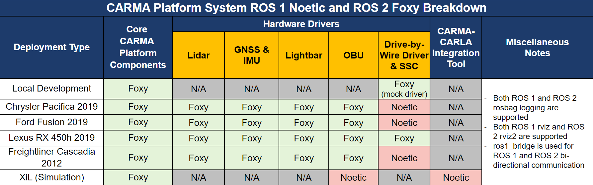

| DockerHub Release | DockerHub Release Candidate | DockerHub Develop |
|------|-----|-----|
 |  | 

# CARMAConfig
The CARMAConfig repository stores the deployment-specific and vehicle-class specific configuration files (such as Docker Compose manifests, network configuration files, system parameters) for use with the different deployment environments (i.e. local development, real vehicle, simulation, etc.) that CARMA Platform supports. A detailed breakdown of how CARMA Platform treats vehicle configuration can be found on the Confluence page: https://usdot-carma.atlassian.net/wiki/spaces/CRMPLT/pages/886276097/Parameter+and+Launch+Design+for+Different+Vehicle+Configurations

## Vehicle Configuration Folders
Folders containing the name of a specific vehicle class (such as 'lexus_rx_450h_2019') contain vehicle configuration data that is specific to that class of vehicle and sensor suite (for example, the launch file for the sensors used on that vehicle). Additionally, folders containing the name of a specific anything-in-the-loop (XiL) scenario contain configuration data that is specific to a scenario conducted in simulation. These folders also contain the Docker Compose files that will launch CARMA Platform with the appropriate configuration. These folders do not contain calibration information that is specific to an individual vehicle.

## Vehicle Calibration Folder
Some parameters are unique to individual vehicles such as precise sensor orientations or controller tunings. These values are stored separately from parameters that apply to classes of vehicles. A special folder structure is used for this purpose, an example of this structure can be seen in the example_calibration_folder directory. Calibration folders should be installed on the vehicle such that their vehicle folders can be found at /opt/carma/vehicle. It is recommended that this be done as a sym-link to a git repository so your vehicle calibration data can be version controlled.

## Example Opt Folder
The CARMA Platform requires that some files be located in the /opt/carma directory so they can be found at runtime. The example_opt_carma folder in this repository contains an example of this folder's structure though some files cannot be included in this repo due to size or license restrictions. Therefore, the installation instructions should be consulted for proper setup. The folder is presented here as a supporting reference and used by development setup scripts.

## Current Status of Hybrid ROS 1/ROS 2 System
The current CARMA Platform system operates as a hybrid of ROS 1 Noetic and ROS 2 Foxy components. While all core CARMA Platform components related to connected and automated vehicle capabilities (communications, localization, routing, trajectory generation, etc.) and all real-world physical sensor drivers are built for ROS 2 Foxy, a small amount of ROS 1 Noetic content still exists within the system. To enable bi-directional communication between ROS 1 Noetic and ROS 2 Foxy portions of the software system, the `ros1_bridge` package is used. The ROS 1 Noetic content that still exists within the CARMA Platform system is described below.

With regards to the primary [carma-platform](https://github.com/usdot-fhwa-stol/carma-platform) repository, the following ROS 1 Noetic content still exists:
- The `rosbag_mock_drivers` and `mock_lightbar_driver` packages, which serve as mock hardware drivers to support local integration testing. These are expected to be upgraded to ROS 2 Foxy in the near future.
- The `carma_record` package, which enables ROS 1 rosbags to be recorded. This package is being preserved to enable legacy data analysis scripts to be used for system evaluation.
- The ROS 1 rviz configuration in the `carma` package, which enables rviz to be run natively when CARMA Platform is deployed on a PC with a ROS 1 Noetic installed to its desktop. This is planned be removed after all ROS 2 Foxy packages are upgraded to ROS 2 Humble.

Additionally, the drive-by-wire driver and SSC packages in the [carma-ssc-interface-wrapper](https://github.com/usdot-fhwa-stol/carma-ssc-interface-wrapper) repository that are used for several CARMA Platform-supported vehicle classes (Chrysler Pacifica, Ford Fusion, and Freightliner Cascadia) are only available for ROS 1 Noetic. These packages are closed source, and the external company providing them does not plan to upgrade them to ROS 2.

Finally, XiL deployments require packages from the [carma-carla-integration](https://github.com/usdot-fhwa-stol/carma-carla-integration) and [carma-ns3-adapter](https://github.com/usdot-fhwa-stol/carma-ns3-adapter) repositories, both of which are built for ROS 1 Noetic due to a dependency on on CARLA 0.9.10, which only exposes a networking bridge for ROS 1. In the near future, when XiL-related repositories are upgraded to support a newer version of CARLA, these packages will be upgraded to ROS 2.

The table below helps visualize this described breakdown of ROS 1 Noetic and ROS 2 Foxy content across the entire CARMA Platform system for different deployment types.

# CARMAPlatform
The primary CARMA Platform repository can be found [here](https://github.com/usdot-fhwa-stol/carma-platform) and is part of the [USDOT FHWA STOL](https://github.com/usdot-fhwa-stol/)
github organization. Documentation on how the CARMA Platform functions, how it will evolve over time, and how you can contribute can be found at the above links as well.

## Contribution
Welcome to the CARMA contributing guide. Please read this guide to learn about our development process, how to propose pull requests and improvements, and how to build and test your changes to this project. [CARMA Contributing Guide](https://github.com/usdot-fhwa-stol/carma-platform/blob/develop/Contributing.md)

## Code of Conduct
Please read our [CARMA Code of Conduct](https://github.com/usdot-fhwa-stol/carma-platform/blob/develop/Code_of_Conduct.md) which outlines our expectations for participants within the CARMA community, as well as steps to reporting unacceptable behavior. We are committed to providing a welcoming and inspiring community for all and expect our code of conduct to be honored. Anyone who violates this code of conduct may be banned from the community.

## Attribution
The development team would like to acknowledge the people who have made direct contributions to the design and code in this repository. [CARMA Attribution](https://github.com/usdot-fhwa-stol/carma-platform/blob/develop/ATTRIBUTION.txt)

## License
By contributing to the Federal Highway Administration (FHWA) Connected Automated Research Mobility Applications (CARMA), you agree that your contributions will be licensed under its Apache License 2.0 license. [CARMA License](https://github.com/usdot-fhwa-stol/carma-platform/blob/develop/docs/License.md)

## Contact
Please click on the CARMA logo below to visit the Federal Highway Adminstration (FHWA) CARMA website.

