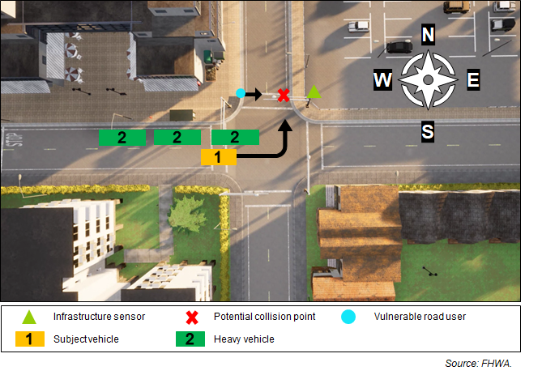

# Anything In the Loop Vunerable Roaduser Use Case 1

## Introduction

This **CARMA Config** includes the docker-compose and configuration file setup for the **Anything In the Loop Vunerable Roaduser Use Case 1** scenario.

## Scenario Description

This CARMA Configuration Image creates a **AIL** (Anything-In-the-Loop) scenario which includes **CARLA**, **SUMO** , **NS3** (CV2X Model), a **Virtual Signal Controller**, **CARMA Streets** and **CARMA Platform**. The scenario configured in this CARMA Config image is meant to highlight the benefits of **Cooperative Perception**  or **VRU** (Vulnerable Road User) safety. In this use case, infrastructure sensor infromation is shared with CDA (Cooperative Driving Automation) vehicles via the **SDSM**(J3224 Sensor Data Sharing Message). The scenario takes place in an intersection in **CARLA Town 4** and spawns 1 **CARMA Platform Vehicle** and 1 **CARMA Streets** instance deployed at an intesection. The vehicle attempts to take a left turn while a pedestrian, spawned by **CARLA ScenarioRunner** attempts to cross the street at a signalized intersection. Three large trucks obscure the  pedestrian from vehicle's lidar sensor vision. An Infrastructure lidar sensor has an unobscructed view of the pedestrian and shares information with the vehicle via V2X message (SDSM). Using the shared information the vehicle is able to safely avoid the pedestrian.

## Simulators

| Simulator      | Version |
| ----------- | ----------- |
| CARLA      | 0.9.10       |
| SUMO      | 1.15       |

## Deployment Instructions
### Deployment Steps
TODO: Complete this section
Copy all files in the route_config directory to `/opt/carma/routes/`
### Locally Built Docker Images
The Virtual Signal Controller is built locally and currently only available to licenced users.

## Data Collection
### Carla Recorder
This **CARMA Config** includes volumes and images that will use **Carla's** [recorder](https://carla.readthedocs.io/en/0.9.10/adv_recorder/) functionality to record **CARLA** simulation data into a `carla-recorder/` directory. Included will be a `Trb2024_1.json` file and a `Trb2024_1.log` file. The name of the file comes from the scenario name defined in the **scenario-runner** image. The `.json` file is a criteria file created by the **scenario runner** image and the `.log` file the carla simulation recording created by the carla server running in the **CDASim** image(see https://carla-scenariorunner.readthedocs.io/en/latest/metrics_module/). Using the metrics module in carla-scenario-runner we can define metrics in carla and evaluate the metrics from the carla recordings. This works for collision monitoring and will be prototyped for a custom defined near miss metric.

