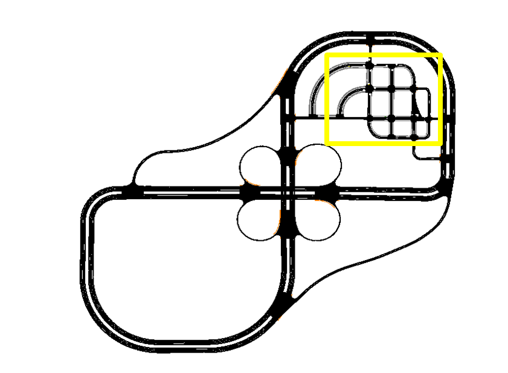
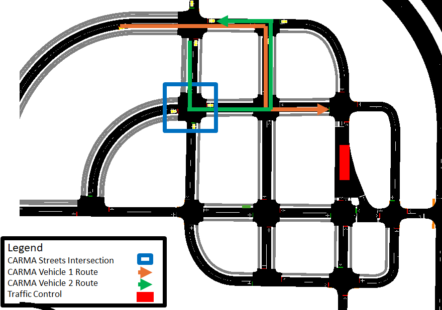

# K900 CARMA Cloud CDASim Integration scenario Scenario

## Introduction

This **CARMA Config** includes the docker-compose and configuration file setup for the **K900 CARMA Cloud CDASim Integration scenario Scenario** scenario.

## Scenario Description

This CARMA Configuration Image creates a **XIL** (Anything-In-the-Loop) scenario which includes **CARLA**, **SUMO** , **NS3** (CV2X Model), a **Virtual Signal Controller**, **CARMA Streets** and **CARMA Platform**. The scenario configured is meant to show base basic CDASim functionality along with the new developed **CARMA Cloud** integration. **CARMA Cloud** is a cloud application used to maintain and provide traffic controls for autonomous vehicles to use to update their local maps. The diagrams below illustrate the configured scenario including vehicle routes and infrastructure location.

## Simulators

| Simulator      | Version |
| ----------- | ----------- |
| CARLA      | 0.9.10       |
| SUMO      | 1.15       |

## Deployment Instructions

1) Copy all files in the `cdasim_config/route_config` directory to  directory to `/opt/carma/routes/`
2) Copy the osm map in `cdasim_config/carma/` directory to `/opt/carma/maps/` and create a symbolic link to it named `vector_map.osm`
3) Unzip <folder_name and or link> in `cdasim_config/` to create `cdasim_config/carmacloudvol/` with traffic controls and xodr map
4) Build Virtual Signal Controller image locally
5) Install carma-script extension
6) Build or pull carma-config image and run `carma config set <image_name>`
7) Navigate to the `cdasim_config/` directory and run the `start_simulation` script
8) To stop the simulation simply run the `stop_simulation` script in the same directory (ensure any kafka data from carma streets is collected before stopping simulation)
9) This scenario can generate a lot of logged data, using the `clear_logs` script in the same directory will clear **CDASim**, **CARMA Streets**, and **CARMA Platform Logs**

