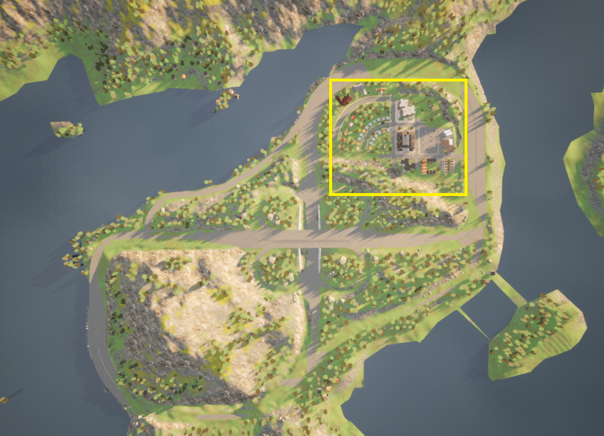
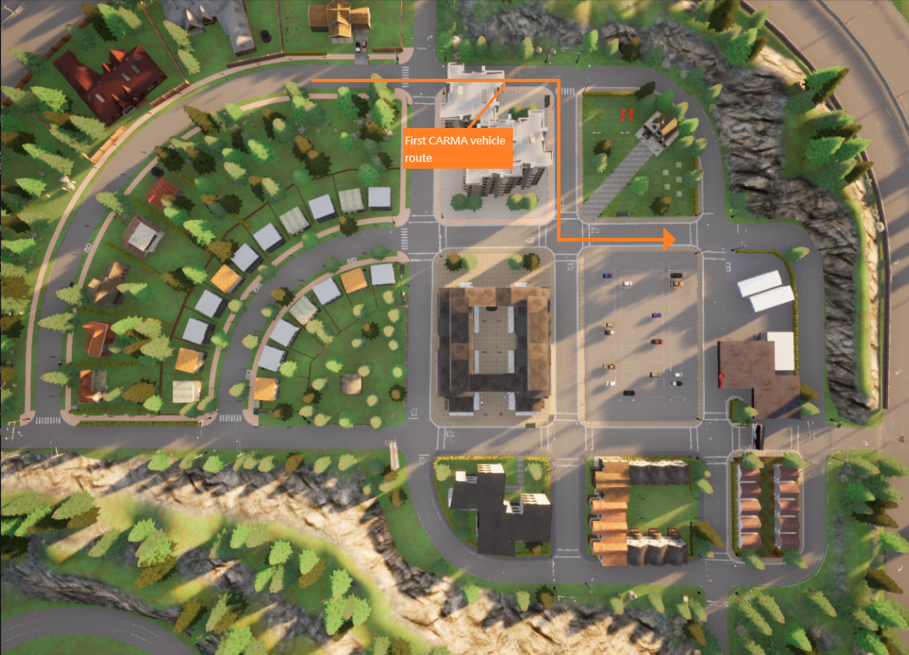
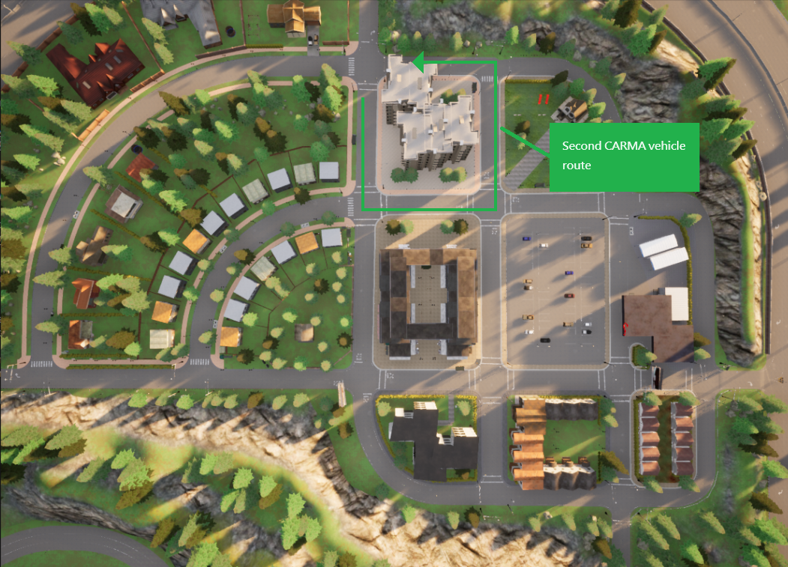

# K900 CARMA Street CDASim Integration Scenario

## Introduction

This **CARMA Config** includes the docker-compose and configuration file setup for the **K900 CDASim Integration Scenario**.

## Scenario Description

This CARMA Configuration Image creates a **XIL** (Anything-In-the-Loop) scenario which includes **CARLA**, **SUMO** , **NS3**, a **Virtual Signal Controller** and **CARMA Platform**. The scenario configured is meant to show base basic CDASim functionality along with the new developed **CARMA Streets** integration. **CARMA Streets** is a component of CARMA ecosystem, which enables such a coordination among different transportation users. This component provides an interface for CDA participants to interact with the road infrastructure. **CARMA Streets** is also an edge-computing unit that improves the efficiency and performance of the Transportation Systems Management and Operations (TSMO) strategies.

## Simulators

| Simulator      | Version |
| ----------- | ----------- |
| CARLA      | 0.9.10       |
| SUMO      | 1.15       |

## Deployment Instructions

1) Copy all files in the `cdasim_config/route_config` directory to directory to `/opt/carma/routes/`
2) Copy the osm map in `cdasim_config/carma/` directory to `/opt/carma/maps/` and create a symbolic link to it named `vector_map.osm`

3) Build Virtual Signal Controller image locally (see instructions in [Setup CARMA Config](https://usdot-carma.atlassian.net/wiki/spaces/CRMSIM/pages/2526937089/Setup+Instructions+Documentation+CARMA-Streets+Integration) step 1 )
4) Install carma-script extension (see instructions in [Setup CARMA Scripts](https://usdot-carma.atlassian.net/wiki/spaces/CRMPLT/pages/488472599/Setup+CARMA+Platform+Runtime))
5) Build or pull carma-config image and run `carma config set <image_name>`
