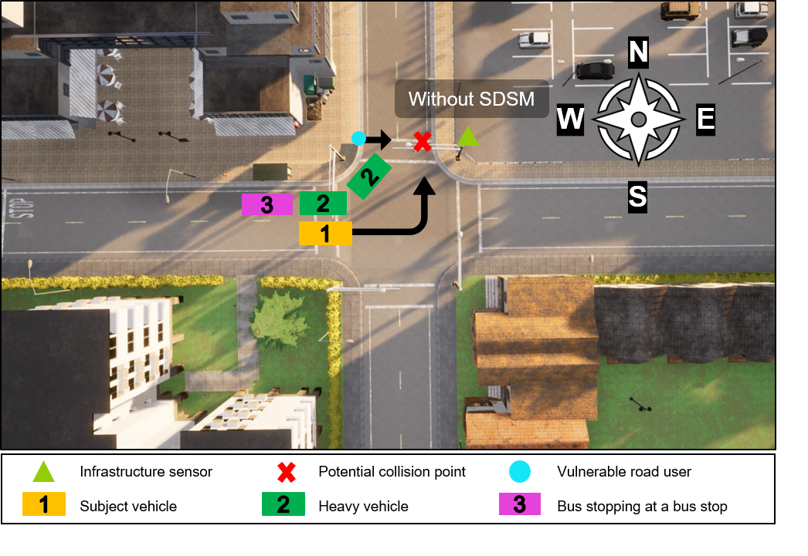
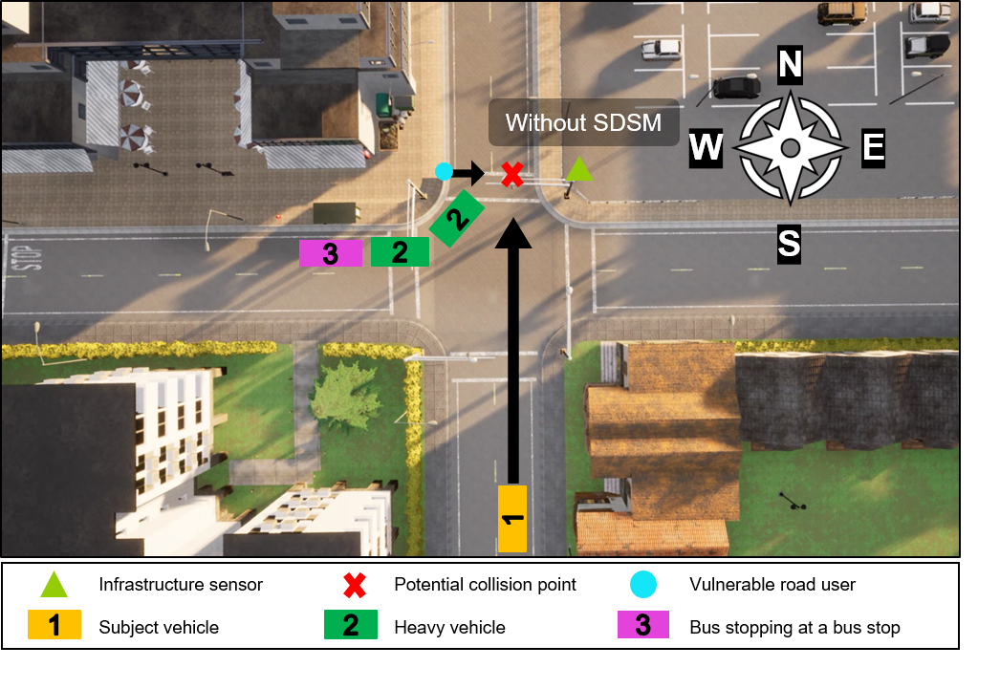

# Anything In the Loop Vunerable Roaduser Use Case 1

## Introduction

This **CARMA Config** includes the docker-compose and configuration file setup for the **Anything In the Loop Vunerable Roaduser Use Case 1** scenario.

## Scenario Description

This CARMA Configuration Image creates a **XIL** (Anything-In-the-Loop) scenario which includes **CARLA**, **SUMO** , **NS3** (CV2X Model), a **Virtual Signal Controller**, **CARMA Streets** and **CARMA Platform**. The scenario configured in this CARMA Config image is meant to highlight the benefits of **Cooperative Perception**  or **VRU** (Vulnerable Road User) safety. In this use case, infrastructure sensor infromation is shared with CDA (Cooperative Driving Automation) vehicles via the **SDSM**(J3224 Sensor Data Sharing Message). The scenario takes place in an intersection in **CARLA Town 4** and spawns 1 **CARMA Platform Vehicle** and 1 **CARMA Streets** instance deployed at an intesection. The vehicle attempts to take a left turn while a pedestrian, spawned by **CARLA ScenarioRunner** attempts to cross the street at a signalized intersection. Three large trucks obscure the  pedestrian from vehicle's lidar sensor vision. An Infrastructure lidar sensor has an unobscructed view of the pedestrian and shares information with the vehicle via V2X message (SDSM). Using the shared information the vehicle is able to safely avoid the pedestrian.

### Traffic Signal Controller configuration
| Phases | Min Green (s) | Min Green Recall |
| ----------| ----------- |--------- |
| 2,6 | 35 | TRUE |
| 4,8 | 5 | TRUE|
### Scenario: West to North Left Turn (A)

### Scenario: South to North Through (B)

## Simulators

| Simulator      | Version |
| ----------- | ----------- |
| CARLA      | 0.9.10       |
| SUMO      | 1.15       |

## Deployment Instructions
### Deployment Steps
1) Copy all files in the `xil_vru_uc1_scenario/cdasimconfig/route_config/` directory to `/opt/carma/routes/`
2) Navigate to `xil_vru_uc1_scenario` and `./build_image.sh` to build CARMA Config image. (Optional if remote image exists)
   1) `./build_image/sh` should print resulting image name
3) Run `carma config set <carma-config-image-name>`
4) Navigate to the `cdasim_config/` directory.
5) `./run_simulation` script clears all necessary volumes and containers and runs `carma start all`
6) Launch a second terminal and run `./stop_simulation` to stop the simulation and collect data.
### Locally Built Docker Images
The Virtual Signal Controller is built locally and currently only available to licenced users.

## Data Collection
### Carla Recorder
This **CARMA Config** includes volumes and images that will use **Carla's** [recorder](https://carla.readthedocs.io/en/0.9.10/adv_recorder/) functionality to record **CARLA** simulation data into a `carla-recorder/` directory. Included will be a `Trb2024_1.json` file and a `Trb2024_1.log` file. The name of the file comes from the scenario name defined in the **scenario-runner** image. The `.json` file is a criteria file created by the **scenario runner** image and the `.log` file the carla simulation recording created by the carla server running in the **CDASim** image(see https://carla-scenariorunner.readthedocs.io/en/latest/metrics_module/).The criteria json for the VulnerableRoadUser scenarion should look something like this :
```json
{
    "CollisionTest": {
        "children": [],
        "feedback_message": "",
        "blackbox_level": 4,
        "_terminate_on_failure": false,
        "test_status": "FAILURE",
        "expected_value_success": 0,
        "expected_value_acceptable": null,
        "actual_value": 1,
        "optional": false,
        "_collision_sensor": null,
        "other_actor": null,
        "other_actor_type": null,
        "registered_collisions": [],
        "last_id": null,
        "collision_time": 27.05000040307641,
        "terminate_on_failure": false
    },
    "RunningRedLightTest": {
        "children": [],
        "feedback_message": "",
        "blackbox_level": 4,
        "_terminate_on_failure": false,
        "test_status": "SUCCESS",
        "expected_value_success": 0,
        "expected_value_acceptable": null,
        "actual_value": 0,
        "optional": false,
        "list_traffic_events": [],
        "_last_red_light_id": null,
        "debug": false,
        "terminate_on_failure": false
    }
}
```
This JSON file will provide information on whether any Collisions and RedLightRunning events took place during the run. Both are considered conditions for a test failure.The JSON should also provide information about the event that caused test failures like time, actor involved, and other event information althoguth this functionality seems to be currently broken, likely due to Carla Scenario Runner bugs.

